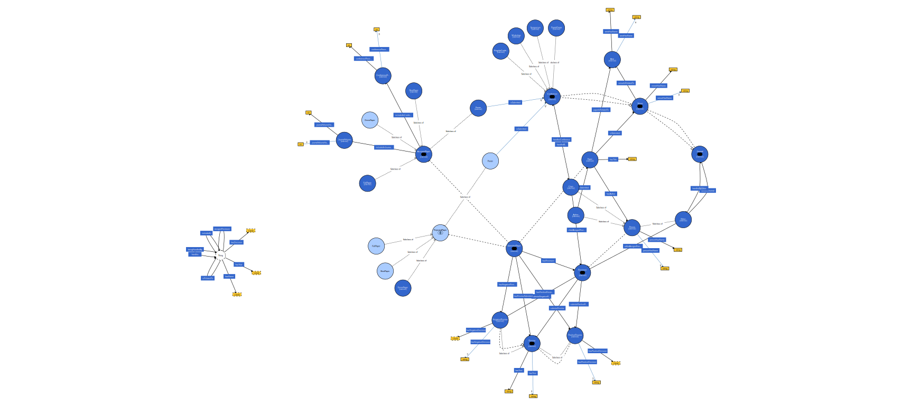
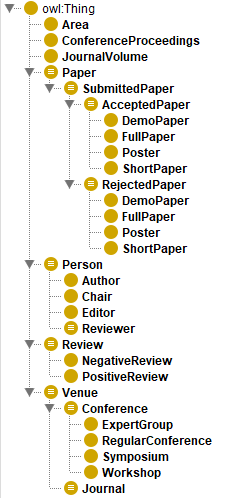
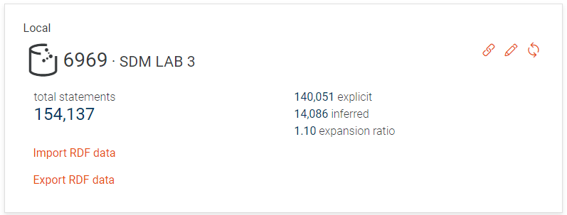
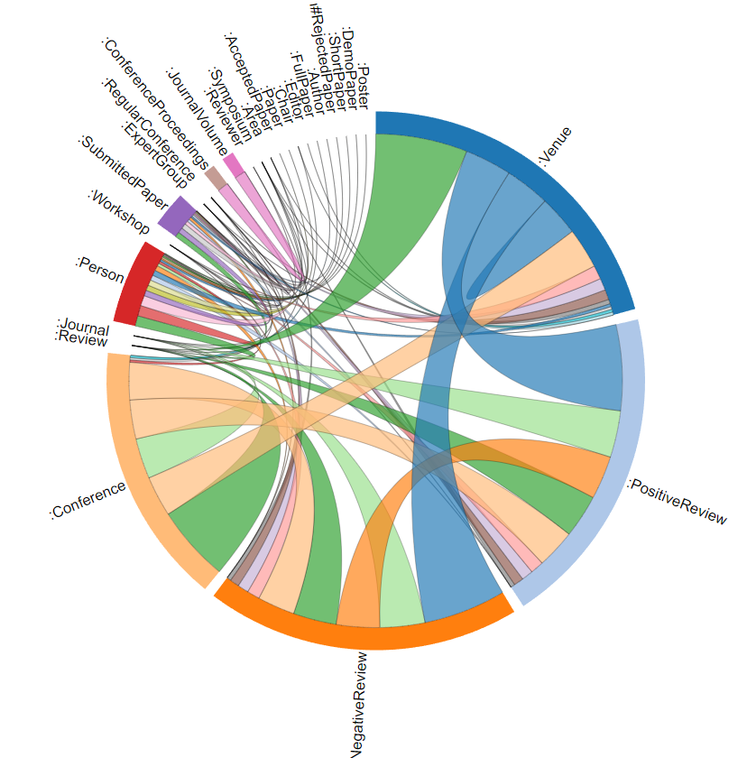

# Semantic Data Management
Project of Semantic Data Management (SDM) Course for the `Master in Data Science` Program of Universitat Politècnica de Catalunya (UPC)
***
## Knowledge Graph of Scientific Research Papers 
This laboratory session focuses on knowledge graphs using the GraphDB database. It is recommended that participants familiarize themselves with `RDF Schema`[^1], `SPARQL`[^2] specification, and the `GraphDB`[^3] manual before attending.

### Setup Instructions
1. **Download and Install GraphDB**:
   - Download from [GraphDB Free](https://www.ontotext.com/products/graphdb/graphdb-free/).
   - Follow installation steps without altering default settings.
   
2. **Launch GraphDB**:
   - Start the server and access the GraphDB interface through `http://localhost:7200/`.
   
3. **Configure Settings**:
   - Navigate to `Settings...` and set custom java properties:
     - `graphdb.workbench.maxUploadSize=40000000000`
     - `Xmx=2000m`
   - Save and restart GraphDB.
   
4. **Load DBpedia Dump Data**:
   - Download and **unzip** Terminological Axioms (`TBOX`) and data instances (`ABOX`) data files from DBpedia[^4].
       - [http://downloads.dbpedia.org/2014/dbpedia_2014.owl.bz2](http://downloads.dbpedia.org/2014/dbpedia_2014.owl.bz2)
       - [http://downloads.dbpedia.org/2014/en/instance_types_en.nt.bz2](http://downloads.dbpedia.org/2014/en/instance_types_en.nt.bz2)
   - Create a repository with inference set to `RDFS-Plus (Optimized)`.
   - Import `RDF` data files into GraphDB using the specified base IRI: `http://dbpedia.org/resource/`.
   - Click on `Setup` and activate `Autocomplete`.

### Session Activities
#### A. Exploring DBpedia
- Used GraphDB’s visual interface to explore the `classes` and `properties` within DBpedia.
- Performed `SPARQL` queries to understand the structure and relationships within the dataset.

#### B. Ontology Creation
1. **TBOX Definition**:
   - The following text includes the `TBOX` design requirements which needed to be fullfiled by the `Knowledge Graph` design:
        ```
        We want to model the concepts of paper, authorship, publication and review. Specifically, authors submit papers to venues, which can be either a conference or a journal. Conferences are handled by chairs, while journals by editors. Chairs (respectively, editors) assign at least 2 reviewers to the submitted paper. Reviewers then submit their decision (accept, reject) and a review text backing up their decision. Those papers accepted are considered a publication and are included either in the conference proceedings or in a journal volume. It is up to you to include the attributes you consider for each concept (at least one per concept). Further, in this case, we want to fully exploit semantics. For this reason, consider that a paper can be a full paper, a short paper, a demo paper or a poster (only for conferences). Conferences can be classified into workshops, symposiums, expert groups or regular conferences (all of them work in the same way, though). Finally, conferences, journals and papers / publications are related to one or more areas (e.g., machine learning, databases, natural language processing, etc.)
        ```
   - Protege[^5] tool was utilized to create the ontology, by using `OWL` as the knowledge graph language. The design is presented as follows:
   
   

   - However, for a clearer representation the `Class Hierarchy` of the design is included here:

        
    
    - The final `TBOX` that incorporates the full set of constraints described at the text above, together with some assumptions that were necessary for the development of the project is included in the file: [TBOX.rdf](./TBOX_ABOX_files/TBOX.rdf).
        - For further information on the constraints and assumptions one can take a look at the [project's report](./docs/Report.pdf).


2. **ABOX Definition**:
    - During `ABOX` definition is crucial to generate and manipulate triples to align with the defined `TBOX`, using tools such as **Jena API**[^6] that manages data transformations and triple creation.
    - Data collected from [https://www.aminer.org/citation](https://www.aminer.org/citation), and specifically the 14th version of the dataset was used ([DBLP-Citation-network V14](https://originalfileserver.aminer.cn/misc/dblp_v14.tar.gz)).
    - As described in the [project's report](./docs/Report.pdf), the dataset was preprocessed following two sequential preprocessing steps, which are included in files: [preprossecing-step-1](./preprocessing_scripts/preprocessing-step1.ipynb) and [preprossecing-step-2](./preprocessing_scripts/preprocessing-step2.py).
        - During [preprossecing-step-1](./preprocessing_scripts/preprocessing-step1.ipynb), the json files downloaded from [aminer.org](https://www.aminer.org/), were transformed into a single CSV file.
        - During [preprossecing-step-2](./preprocessing_scripts/preprocessing-step2.py) a final CSV file was prepared in order to include extra information requested for the specific solution.
    - Finally, for the creation of the `ABOX`, the `RDF API` as well as the `Ontology API` were used.
        - Software can be found under [Jena API Main Function](./knowledge_graph_ABOX/src/main/java/Main.java).
        - The final versions of the `TBOX`, the preprocessed data utilized, and the generated `ABOX` can be found in folder [resources](./knowledge_graph_ABOX/src/main/resources/).
    - The lowest level of hierarchies were always being utilized while creating the triples for all components, in order to generate all the available knowledge with the minimum statements and insertions possible.
    - Detailed description of the methodology is included in the [project's report](./docs/Report.pdf).

3. **Final Ontology Setup**:
   - Ensured programmatically (in the previous step) with the usage of Jena API that `rdf:type` links are correctly set between `TBOX` and `ABOX`.
   - Imported `TBOX` and `ABOX` into `GraphDB`.
        - It is important to note that we used the option `RDFS-Plus (Optimized)` during the importing of the knowledge graph, in order to enable reasoning for GraphDB.
        - For the base IRI we used the following one: <http://www.semanticweb.org/sdm>, which is the same that was used by Protege while generating the TBOX.
   - The overall information of the `knowledge graph` entries is presented here:
   
   - In order to compute a summary and basic statistics for the instances of the graph, we used the following queries which aim in computing the total number of classes, properties, and specific instances both from classes and properties respectively:
        - **Total Number of Classes**:
            ```
            PREFIX owl: <http://www.w3.org/2002/07/owl#>
            SELECT (COUNT(DISTINCT ?class) AS ?numClasses) WHERE {
                ?class a owl:Class.
            }
            ```
        - **Total Number of Distinct Properties**:
            ```
            PREFIX rdf: <http://www.w3.org/1999/02/22-rdf-syntax-ns#>
            SELECT (COUNT(DISTINCT ?property) AS ?numProperties) WHERE {
                ?property a rdf:Property.
            }
            ```
        - **Total Number of Distinct Instances of each class being a Subclass of the Specified class_URI**:
            ```
            PREFIX rdf: <http://www.w3.org/1999/02/22-rdf-syntax-ns#>
            PREFIX rdfs: <http://www.w3.org/2000/01/rdf-schema#>
            SELECT DISTINCT ?className (COUNT(DISTINCT ?instance) AS ?numInstances)
            WHERE {
                ?instance rdf:type ?class .
                ?class rdfs:subClassOf* <class_URI>.
            FILTER (!isBlank(?instance))
            }
            GROUP BY ?className
            ```
        - **Total Number of Distinct Triples of each Property property_URI**:
            ```
            SELECT DISTINCT ?propertyName (COUNT(*) AS ?numTriples) WHERE {
                ?s <property_URI> ?o .
            FILTER (!isBlank(?s) && !isBlank(?o))
            }
            GROUP BY ?propertyName
            ```
    - **Final exploratory results**:

        | MEASURE                                           | VALUE |
        |---------------------------------------------------|-------|
        | Total Number of Classes                           | 183   |
        | Total Number of Properties                        | 74    |
        | Total Instances of Class “Paper”                  | 100   |
        | Total Instances of Class “Person”                 | 618   |
        | Total Instances of Class “Review”                 | 100   |
        | Total Instances of Class “Venue”                  | 97    |
        | Total Instances of Class “Author”                 | 318   |
        | Total Papers with “PositiveReview”                | 51    |
        | Total Papers with “NegativeReview”                | 49    |
        | Total Instances of Property “hasAuthor”           | 100   |
        | Total Instances of Property “hasSubmitted”        | 318   |
        | Total Instances of Property “includedInConferenceProceedings” | 28 |
        | Total Instances of Property “includedInJournalVolume”         | 23 |

        


4. **Querying the Ontology**:
   - Executed `SPARQL` queries to interact with the ontology, focusing on authorship and publication data within academic databases.
        - All the respective results are included in folder [query_results](./query_results/).
    - The queries generated are the following:
        - **Find all Authors**:
            ```
            PREFIX rdf: <http://www.w3.org/1999/02/22-rdf-syntax-ns#>
            PREFIX sdm: <http://www.semanticweb.org/sdm/>
            SELECT DISTINCT ?author WHERE {
                ?author rdf:type sdm:Author
            }
            ```
        - **Find all Properties whose Domain is Author**:
            ```
            PREFIX sdm: <http://www.semanticweb.org/sdm/>
            PREFIX rdfs: <http://www.w3.org/2000/01/rdf-schema#>
            PREFIX rdf: <http://www.w3.org/1999/02/22-rdf-syntax-ns#>
            SELECT ?property WHERE {
                ?property rdfs:domain sdm:Author.
            }
            ```
        - **Find all Properties whose Domain is either Conference or Journal**:
            ```
            PREFIX sdm: <http://www.semanticweb.org/sdm/>
            PREFIX rdfs: <http://www.w3.org/2000/01/rdf-schema#>
            PREFIX rdf: <http://www.w3.org/1999/02/22-rdf-syntax-ns#>
            SELECT ?property WHERE {
                {
                    ?property rdfs:domain sdm:Conference.
                }
                UNION
                {
                    ?property rdfs:domain sdm:Journal.
                }
            }
            ```
        - **Find all Papers Written by a Given Author that where Published in Database Conferences**:
            ```
            PREFIX rdf: <http://www.w3.org/1999/02/22-rdf-syntax-ns#>
            PREFIX sdm: <http://www.semanticweb.org/sdm/>
            SELECT ?paper ?author ?conference ?area
            WHERE {
                ?paper rdf:type sdm:AcceptedPaper ;
                sdm:hasAuthor ?author .
                ?author rdf:type sdm:Author ;
                sdm:hasName "Fu_Jin" .
                ?paper sdm:isSubmitted ?conference.
                ?conference sdm:isRelatedTo ?area.
            }
            ```


[^1]: [https://en.wikipedia.org/wiki/RDF_Schema](https://en.wikipedia.org/wiki/RDF_Schema)
[^2]: [https://www.w3.org/TR/sparql11-query/](https://www.w3.org/TR/sparql11-query/)
[^3]: [https://graphdb.ontotext.com/](https://graphdb.ontotext.com/)
[^4]: [https://wiki.dbpedia.org](https://wiki.dbpedia.org)
[^5]: [https://protege.stanford.edu/](https://protege.stanford.edu/)
[^6]: [http://jena.apache.org/index.html](http://jena.apache.org/index.html)